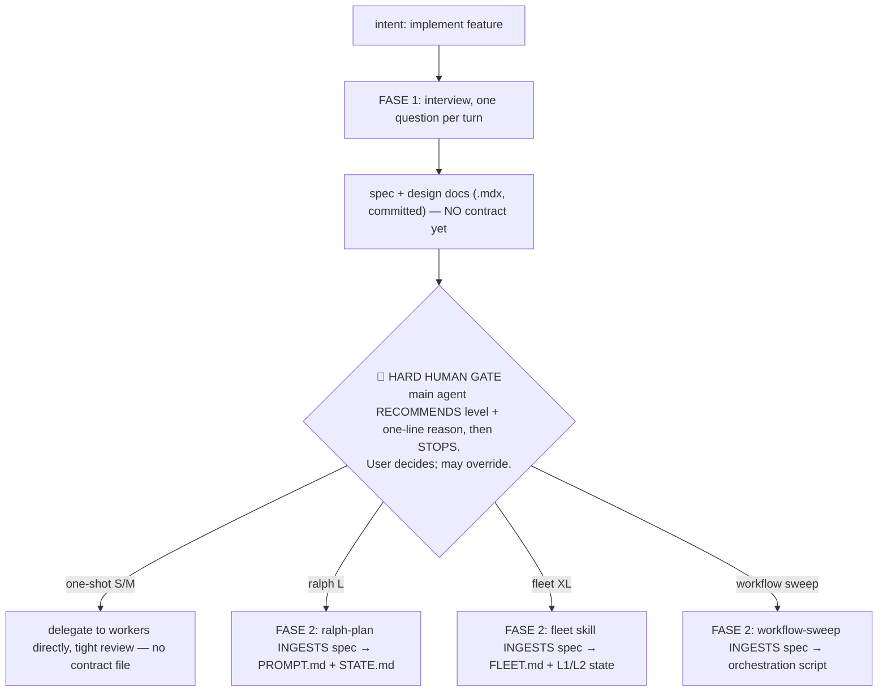
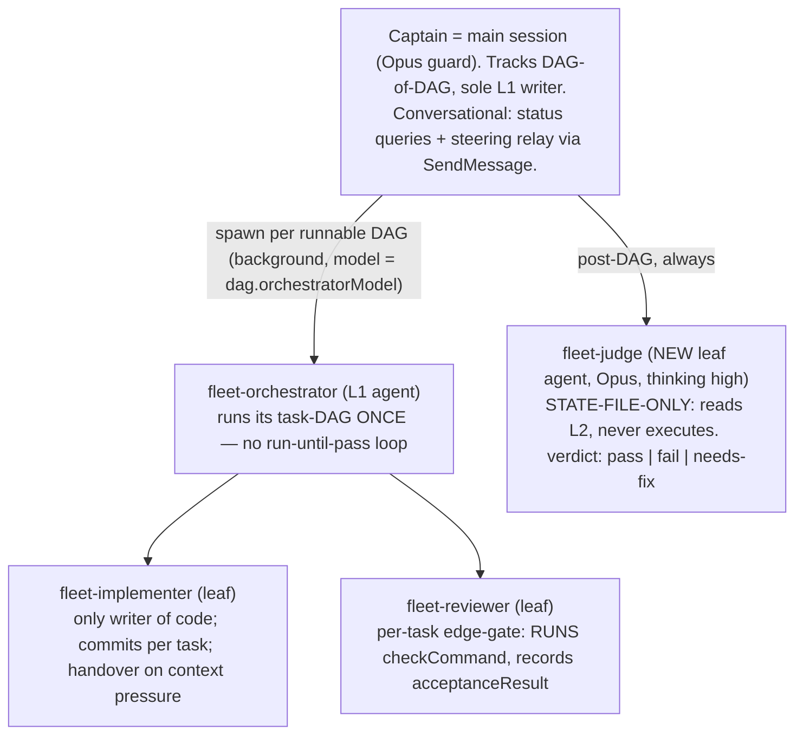

# Pi-parity orchestration rework for Claude Code

<Callout type="success" title="Status: accepted 2026-07-03 — execution authorized">
Approved by user (spec location: plans/&lt;scope&gt;/SPEC.mdx; Go on all work items). Source of truth for the pi side:
`~/.pi/agent/AGENTS.md`, `~/.pi/agent/skills/{fleet-plan,captain,goal-sweep,ralph-preset}/SKILL.md`,
`~/.pi/agent/docs/design/2026-07-03-{fleet-dag-rework,goal-sweep-flow,ralph-migration-dev-lifecycle}.*`.
</Callout>

## Problem

The `~/.claude` orchestration stack lags the `~/.pi` stack in four ways:

1. **Planning is single-phase.** `feature-planning` picks the execution mode *before* a spec
   exists; the executor then authors its own spec inside its contract. Pi locks the reverse:
   spec first (FASE 1), then a hard human gate on the orchestration level, then contract (FASE 2).
2. **Fleet is wave-based.** Pi already discarded waves for a pure `dependsOn[]` DAG with a
   dynamically computed runnable-set, a separate post-DAG judge (Opus, state-file-only, bounded
   2×), two-layer validation, and two-level JSON state.
3. **No sweep flow.** Pi's "goal" flow (wide, repetitive, SAFE-only fan-out) has no Claude
   equivalent — even though Claude Code ships a native `Workflow` tool with near-identical
   primitives.
4. **Gate artifact depends on paid software.** The visual-plan skill renders through Artifacts
   (paid gate). Pi reviews plans as plandeck `.mdx` files on disk — free, committed, diffable.

## Mantra (cost principle, carried over from pi)

**Maximum benefit at chosen cost** — not minimum cost. Suppress expensive tokens where they don't
buy correctness (scouts, mechanical sweeps); spend them where they prevent expensive mistakes
(judge, low-tolerance implementation). Every model-routing choice below is justified by this.

## Decisions locked by the user (2026-07-03)

<Decision title="Fleet rework: full pi-style DAG (no hybrid)" status="accepted">
Waves removed. Pure `dependsOn[]`, runnable-set computed dynamically. Separate judge agent gates
each DAG (bounded 2×). No run-until-pass iteration loop inside fleet — retry exists only as the
judge's bounded second attempt. Claude-only strengths are KEPT: Phase 1.5 real-reflection
preflight, usage-checkpoint, trunk-based mode, FLEET-RESUME-HOOK.
</Decision>

<Decision title="Sweep flow adopted as a FASE-2 option, named 'Workflow' (not 'Goal')" status="accepted">
Claude Code's native `Workflow` tool is the executor. The main agent may recommend Workflow at
the FASE-2 gate for wide/repetitive/SAFE-only work; the user decides. New skill `workflow-sweep`
scaffolds the orchestration script from the approved FASE-1 spec.
</Decision>

<Decision title="Drop visual-plan; adopt plandeck .mdx as the plan/review format" status="accepted">
Visual-plan gated behind paid software → removed from all flows (CLAUDE.md L-tier directive,
fleet Phase 1.2, ralph-plan Step 2.7, opus Step 1.5) and the skill deleted. All plan/design docs
are authored as plandeck `.mdx` (Decision/Callout/mermaid blocks); the L-tier review artifact is
the committed `.mdx` file itself. Port pi's `plandeck-authoring` skill + rule.
</Decision>

---

## 1. Two-phase planning + hard human gate (CLAUDE.md core change)



Rules (verbatim spirit from pi AGENTS.md, adjusted):

- **FASE 1 output = spec + design docs**, mode-neutral, written to the repo (see §5 for
  location), authored as plandeck `.mdx`. No contract, no state file yet.
- **Hard human gate**: the main agent MUST state a recommendation + one-line reason, then STOP.
  It must NOT auto-pick a level and start FASE 2. Applies to all four levels, none skipped.
- **FASE 2 contracts always INGEST the FASE-1 spec** — never re-plan, never reinterpret. The
  spec is authoritative. This is the anti-duplication guarantee across all executors.
- **Intent detection** at conversation start:
  - *implement feature* → FASE 1 flow above.
  - *bug / error / stack trace* → DEBUG MODE, two steps: (1) gather repro/env/expected-vs-actual;
    (2) branch by fix size — small fix → execute directly (main agent MAY touch code; the
    deliberate exception to orchestrator-writes-no-code), medium/large → route into FASE 1.
  - *info / research / other* → serve directly, no ceremony.
- Contract-vs-state distinction stated explicitly: contract authored pre-run by the main agent
  (FASE 2); state built/updated at runtime by the executor.

## 2. Flow taxonomy (replaces current 3-mode triage)

| | One-shot | Ralph | Fleet | Workflow |
|---|---|---|---|---|
| Size | S/M | L (long single slice) | XL / greenfield / multi-DAG | sweep (breadth, not a size) |
| Shape | one coherent change | deep sequential task-DAG | DAG-of-DAG, interdependent | wide, repetitive, independent, same-pattern |
| Low-tolerance OK? | yes (tight review) | yes (full tier routing) | yes (judge-gated) | **NO — SAFE-only, hard rule** |
| Iteration loop | n/a | yes (run-until-pass) | **none** (judge bounded 2×) | none (verify per node) |
| Contract | none | PROMPT.md + STATE.md | FLEET.md + L1/L2 JSON | JS orchestration script |
| Executor | main session + workers | /ralph-loop plugin | fleet skill (captain) | native `Workflow` tool |

**Workflow vs Fleet disambiguation (safety-first, verbatim from pi):** both fan out in parallel,
so decide by SAFETY FIRST. Any low-tolerance surface (auth / secrets / DB migration / schema /
public-API / money / data-deletion / irreversible) in scope → **fleet or ralph, never Workflow**.
No low-tolerance + wide/repetitive/independent → Workflow. Heavy inter-dependency → fleet.

## 3. Workflow sweep flow (new skill `workflow-sweep`)

Pi's goal flow maps almost 1:1 onto Claude Code's native `Workflow` tool:

| pi-dynamic-workflows | Claude `Workflow` tool | Note |
|---|---|---|
| `agent(prompt, opts)` | `agent(prompt, opts)` | identical |
| `parallel` / `pipeline` / `phase` | same | identical |
| `opts.tier` small/medium/big | `opts.model` sonnet/haiku + `opts.effort` | map by hand |
| `opts.agentType` → `.pi/agents/` | `opts.agentType` → agent registry | can bind `sonnet-implementer` |
| `isolation: "worktree"` | `isolation: "worktree"` | identical |
| journaled resume | `resumeFromRunId` + journal | identical |
| vm sandbox, no Date/random | same restriction | scripts deterministic |
| `/workflows save <name>` | `.claude/workflows/` saved scripts | reusable named runs |

Authoring rules baked into the skill (ported from `goal-sweep`):

1. **Phase 1 of the script INGESTS the spec** — enumerates targets, never re-plans.
2. **Every worker prompt BAKES the FASE-1 conventions** (metric names, log schema, span attrs,
   error-feedback contract) via a `SPEC` constant + prompt-builder. No per-branch improvisation.
3. **Worker tier CAPPED**: `model: sonnet` or `haiku` only, `agentType` limited to
   `sonnet-implementer` / `haiku-implementer` / default workflow subagent. **Never `opus`**,
   never an escalate-to-critical path inside the sweep.
4. **Escape hatch**: a worker that discovers its target touches a low-tolerance surface STOPS
   that branch, returns a flagged result, does NOT modify. Flags surface to the user post-run
   and re-route to ralph/fleet.
5. **`isolation: "worktree"`** for every parallel edit phase.
6. **Verify phase asserts the conventions landed** (not just "files changed").

The skill authors the script and stops (terminal). The main agent invokes `Workflow` only after
user approval of the previewed script — mirrors pi's explicit `/workflows run` boundary. No
keyword auto-trigger; Workflow's own opt-in rules already enforce this.

## 4. Fleet DAG rework (skill `fleet` + agents + templates)

### Topology



### Scheduling (replaces waves)

- DAG `d` runnable ⟺ all `d.dependsOn` have `status: passed` AND none in `failedDags[]` AND
  `d` is `pending`. Recompute on every status change. Spawn all runnable DAGs in one message
  (parallel fan-out, background). No barrier.
- Judge verdict `pass` → mark passed, recompute, spawn newly unblocked.
- `fail`/`needs-fix` + attempt < 2 → orchestrator gets pinpoint feedback (offending task,
  artifact pointer), one more attempt, judge re-runs.
- attempt = 2 → DAG `failed`, added to `failedDags[]`; dependents become `blocked-hard`;
  unrelated DAGs continue. Fleet stops when runnable-set empty AND nothing running →
  `stopFlag` + honest report + manual merge commands (base-branch merge stays a human gate).

### Two-layer validation

- **Layer 1 — objective, at the per-task edge-gate:** reviewer (or Opus orchestrator doubling
  as reviewer) MUST execute the task's `checkCommand`; verdict `pass` requires green output,
  recorded as `acceptanceResult` in L2. Last task of each DAG carries the DAG-level integration
  check.
- **Layer 2 — semantic, at the judge:** judge reads L2 only (all `acceptanceResult` +
  holistic integration vs the DAG goal). Never executes commands; trusts recorded results.

### Two-axis routing (planner-set, persisted, never re-derived)

- Axis 1: `failureTolerance` per DAG → `orchestratorModel` (`low` → opus + inline review;
  `standard`/`trivial` → sonnet + separate reviewer per task) + implementer/reviewer tier mapping.
- Axis 2: `thinking`/effort per DAG and per task (maps to Agent `effort` where supported).
- Safety ratchet upgrade-only, `planned*` + `effective*` both persisted; resume reads effective.

### State (2 levels, JSON, committed to the repo)

```
<repo>/plans/fleet/<yyyy-mm-dd>-<epic>/
  FLEET.md              # captain contract — ingests FASE-1 spec, self-contained
  state.json            # L1: dags[] (dependsOn, failureTolerance, orchestratorModel,
                        #     thinking, assignment, judge{verdict,attempt}), dagStatus,
                        #     failedDags[], knowledge[], stopFlag, verification block
  SETUP.md              # Phase 1.5 output (kept from current fleet)
  dags/
    <dagId>-contract.md # per-DAG contract (stands alone; NO loop language)
    <dagId>.json        # L2: tasks[] (dependsOn, implementer, reviewer, thinking,
                        #     edgeGateStatus, commitSha, checkCommand, acceptanceResult,
                        #     reviewVerdict), assignment ratchet, knowledgeDelta[]
```

Template masters live at `~/.claude/templates/fleet-captain.state.template.json` +
`fleet-dag.state.template.json`.

### Kept from the current Claude fleet (pi lacks these — do NOT lose)

<Callout type="info" title="Claude-only strengths preserved">
- **Phase 1.5 real-reflection preflight**: audit DB/browser/CI capability, SETUP.md with
  [REQUIRED] items, Build blocked until green, re-probe on every Build entry. `needsDb` /
  `needsBrowser` tags per DAG.
- **usage-checkpoint**: invoked on every Build entry; checked before dispatching each runnable
  batch and after each DAG returns (replaces "wave barrier" wording). Timer-before-100% invariant.
- **Trunk-based mode** (merge target + push cadence) and **FLEET-RESUME-HOOK** in repo CLAUDE.md.
- **Resume on bare `continue`** — step-0 glob for `status: running` now reads `state.json`.
- **Knowledge write policy by orchestrator model** (`writeKnowledgeDirectly` ≙ pi's
  Opus-promotes / Sonnet-proposes) — already aligned; generalize wording to "tier, not role".
</Callout>

New: captain stays conversational mid-run — answers status from live L1, relays user steering
to running orchestrators via `SendMessage` (two-hop: captain → orchestrator → worker), never
kill+respawn to redirect.

### Agent file changes

- `fleet-judge.md` — NEW. Opus, leaf (Read/Grep/Glob only — no Bash: state-file-only by
  construction), verdict `pass|fail|needs-fix` + pinpointed task + evidence.
- `fleet-orchestrator.md` — remove "loops implement→review until go or budget"; execute
  task-DAG once with per-task edge-gates; honor L2 resume (`commitSha` per task); handover
  protocol unchanged.
- `fleet-reviewer.md` — must RUN `checkCommand` and record `acceptanceResult`; go/no-go stays
  but is layer-1 only (judge owns the DAG gate).
- `fleet-implementer.md` — unchanged except explicit per-task checkpoint-commit requirement.

## 5. FASE-1 spec location + plandeck adoption

<Decision title="FASE-1 spec lives at plans/<scope>/SPEC.mdx; design docs in docs/design/" status="accepted">
Scope-level, mode-neutral: `plans/<scope>/SPEC.mdx` (+ supporting
`docs/design/<yyyy-mm-dd>-<topic>.mdx` for architecture decisions that outlive the scope).
Slice folders `plans/<scope>/<nnn>-<slice>/` keep holding FASE-2 contracts, unchanged.
Plandeck globs cover `docs/**` and `plans/**` so both render.
</Decision>

- Port `plandeck-authoring` skill from `~/.pi/agent/skills/plandeck-authoring/` →
  `~/.claude/skills/plandeck-authoring/SKILL.md` (adjust pi-isms).
- CLAUDE.md: planning-docs section gains "plans/design docs authored as plandeck `.mdx`
  (Decision/Callout/mermaid); follow `plandeck-authoring`". Project-level rule via
  `/promote-rules` per repo when relevant.
- L-tier review gate = the committed `.mdx` itself (user browses via Plandeck). Replaces every
  visual-plan gate.

## 6. Ralph adjustments (skill `ralph-plan`)

- New Step 0.5 — **spec detection**: if `plans/<scope>/SPEC.mdx` (or a user-pointed spec)
  exists → **ingest mode**: skip the full interview, ask only about gaps, derive the contract
  from the spec. The spec is authoritative; do not re-plan. No spec → run FASE 1 first (emit
  SPEC.mdx), then gate, then continue as FASE 2.
- Step 2.7 visual plan → replaced: L-tier review artifact is the SPEC/design `.mdx` (plandeck).
- Loop mechanics unchanged (`/ralph-loop` plugin, PROMPT.md re-fed per iteration). Pi's
  hat/fresh-session model is plugin-specific and NOT portable — documented as a non-goal.

## 7. Visual-plan removal map

| Location | Change |
|---|---|
| `~/.claude/skills/visual-plan/` | delete skill dir |
| CLAUDE.md "Visual plan — L-tier design output" section | replace with plandeck `.mdx` review-gate directive |
| `skills/fleet/SKILL.md` Phase 1.2 + `visualPlanUrl` | replace with "author FLEET.md + SPEC references as `.mdx`; gate reviews the files" |
| `skills/ralph-plan/SKILL.md` Step 2.7 | replace per §6 |
| `skills/opus/SKILL.md` Step 1.5 | plan-only subagent returns a plandeck `.mdx` plan doc instead of a visual-plan URL |
| `skills/visual-recap/` | delete skill dir (user 2026-07-03: part of the visual-plan family, never used) |

## Work items (FASE-2 of this rework itself)

| # | Task | Files | Tier | Deps |
|---|---|---|---|---|
| 1 | CLAUDE.md rewrite: two-phase + hard gate + intent detection + 4-flow taxonomy + plandeck directive + remove visual-plan section | `~/.claude/CLAUDE.md` | M | — |
| 2 | Rewrite `feature-planning` → FASE-1 planner (interview → SPEC.mdx → recommend → gate) | `skills/feature-planning/SKILL.md` | M | 1 |
| 3 | New `workflow-sweep` skill (§3) | `skills/workflow-sweep/SKILL.md` | M | 1 |
| 4 | Fleet rework (§4): skill + FLEET.md shape | `skills/fleet/SKILL.md` | L | 1 |
| 5 | New `fleet-judge` agent + update orchestrator/reviewer/implementer agents | `agents/fleet-*.md` | L | 4 |
| 6 | State templates L1/L2 | `templates/fleet-*.template.json` | S | 4 |
| 7 | Port `plandeck-authoring` skill | `skills/plandeck-authoring/SKILL.md` | S | — |
| 8 | Ralph ingest mode + drop 2.7 | `skills/ralph-plan/SKILL.md` | S | 1,7 |
| 9 | Opus skill: 1.5 → plandeck plan doc | `skills/opus/SKILL.md` | XS | 7 |
| 10 | Delete visual-plan; strip refs in visual-recap | `skills/visual-plan/`, `skills/visual-recap/` | XS | 1 |
| 11 | usage-checkpoint wording: wave barrier → scheduling-loop checkpoints | `skills/usage-checkpoint/SKILL.md` | XS | 4 |
| 12 | chezmoi add + commit + push all of the above | dotfiles repo | XS | all |

## Risks

| Risk | Mitigation |
|---|---|
| Judge trusts a stale/faked `acceptanceResult` | Layer-1 rule: reviewer records result ONLY from a command it ran itself; judge cross-checks `commitSha` presence per task |
| No-loop fleet feels stricter than today's implement→review loop → more DAG failures | Bounded 2× retry + pinpoint feedback is the pi-tested middle ground; failures degrade gracefully via `failedDags` |
| CLAUDE.md edits mid-session bust prompt cache | Execute all edits in one batch at the end of the approved run |
| Workflow tool availability differs per plan/session | `workflow-sweep` skill checks tool presence first; falls back to recommending fleet/one-shot |
| Plandeck viewer availability on `~/.claude` repos | `.mdx` degrades gracefully as plain markdown; blocks are readable inline |
