# Report authoring — crystallized lessons at repo level

Reports = lesson-learnt yang commit ke repo, published, RAG-visible. Distinct from dev-journal (personal, cross-repo, private): a report belongs to THIS repo, ships with its docs site, and answers "pernah kena error X di repo ini?" via llms.txt.

Structure on the site: **Reports (sidebar group, collapsed) → Index of Reports (single page in sidebar) → content pages** (reachable from the index, not listed individually in the sidebar).

## When to write / offer

After any of: nontrivial bug fixed (root cause found), vendor/dependency quirk or breaking change, ops incident resolved, perf gotcha discovered, or a **known symptom recurs**. Offer one line — "Report ini?" — same convention as journal-nudge. Approved → follow this skill. Rejected → no re-nag.

## File convention — monthly cadence, split per topic

```
docs/src/content/docs/reports/
├── index.mdx                        ← Index of Reports (only sidebar entry)
├── 2026-07-starlight-sidebar.mdx    ← <yyyy-mm>-<topic-slug>.mdx
└── 2026-07-git-status-uall.mdx
```

- One file per **(month, topic)**. Topic slug = the symptom family, kebab-case, stable across months.
- Recurrence **same month + same topic** → append a row to that file's Recurrence log (update Root cause/Fix if understanding changed). No new file.
- Recurrence in a **new month** → new file `<new-month>-<same-topic>.mdx`, first line links the predecessor ("Previously: [2026-06](/reports/2026-06-topic/)"). This is how "sampai kapan kejadian ini" stays answerable — the chain shows the lesson's lifespan.
- BEFORE creating a file, grep `reports/` for the symptom (exact error string first, then topic words). Hit → append/chain instead of duplicating.

## Report structure — literal headings, greppable

```mdx
---
title: Starlight ≥0.39 sidebar autogenerate breaking change
description: astro build fails "Found an autogenerate object with a label" — sidebar syntax changed in Starlight 0.39.
date: 2026-07-07
severity: medium
tags: [tech/astro, tech/starlight, kind/breaking-change, area/build]
---

## Symptom

```txt
[AstroUserError] Invalid config passed to starlight integration —
Found an autogenerate object with a label.
```

## Context

Versions, environment, what was being done when it hit.

## Telemetry

<!-- MANDATORY when a trace was available during debugging; omit section otherwise -->
Trace ID: `4bf92f3577b34da6a3ce929d0e0e4736`

```mermaid
gantt
    title Relevant spans — POST /api/v1/orders (only spans that tell the story)
    dateFormat  x
    axisFormat  %L ms
    section api-gateway
    POST /orders (200ms)        :0, 200
    section order-svc
    validate cart (5ms)         :10, 15
    reserve stock — ERROR (150ms) :crit, 20, 170
    section inventory-db
    SELECT ... FOR UPDATE (140ms) :crit, 25, 165
```



## Offending code

<!-- MANDATORY when the culprit code was identified during debugging; omit otherwise -->
`src/pipeline/order.ts:42`

```ts title="src/pipeline/order.ts" {3}
export async function reserveStock(items: Item[]) {
  for (const item of items) {
    await db.query('SELECT ... FOR UPDATE'); // N+1 lock, serial per item
  }
}
```

## Root cause

WHY it happened — not just what the fix was.

## Fix

Concrete steps / diff. Use ```diff fences.

## Lesson

1–3 sentence going-forward rule. If path-scoped → candidate for /promote-rules.

## Follow-ups

<!-- Actionable next steps NOT done as part of the fix; omit when none. Checkboxes — tick as done. -->
- [ ] Add alert on `inventory-db` lock wait > 100ms (owner: ops)
- [ ] Promote lesson to project rule via /promote-rules
- [x] Backfill regression test (done 2026-07-08, PR #123)

## Recurrence log

| Date | Where | Trace ID | Notes |
|---|---|---|---|
| 2026-07-07 | scaffold test | — | first hit |
```

- **Frontmatter**: `title` + `description` required (description carries symptom keywords — llms.txt index + customSets entry text). `date` = first hit of this month's file. `severity` — impact when it hit: `critical` = data loss / prod down / money wrong; `high` = prod user-facing impact or blocked release; `medium` = dev-time sink, wrong builds, flaky CI; `low` = annoyance/papercut. `tags` — scoped format `<scope>/<item>`, three fixed scopes:
  - `tech/<name>` — technology/dependency involved (`tech/astro`, `tech/postgres`). Kebab-case, no versions (`tech/postgres` not `tech/postgresql16`).
  - `kind/<name>` — failure kind (`kind/breaking-change`, `kind/race-condition`, `kind/config-error`, `kind/oom`, `kind/n-plus-one`, `kind/vendor-quirk`).
  - `area/<name>` — repo subsystem hit (`area/build`, `area/ci`, `area/auth`, `area/ingest`).

  Scoped tags = quick lookup per axis: `grep -rl "kind/breaking-change" docs/src/content/docs/reports/` answers "breaking change apa saja yang pernah kena", `grep -rl "tech/kafka"` answers "semua lesson Kafka". At least one tag per scope when applicable. **Discover before minting** — reuse existing spellings, never scope-less tags: `grep -rhoE '(tech|kind|area)/[a-z0-9.+-]+' docs/src/content/docs/reports/ | sort -u`. Recurrence with worse impact → bump `severity` up (never down).
- **Symptom quoted verbatim in a code fence** — non-negotiable. It is the RAG/grep key: paste the error → find the report.
- **Telemetry — MANDATORY when a trace existed during debugging**, omit the section entirely otherwise. Record the trace ID verbatim (grep/Tempo/Grafana lookup key later) and DRAW the spans as a mermaid `gantt` waterfall: `section` per service, one bar per span with duration, `:crit` on the failing/slow span. **Relevant spans only** — the 3–8 that tell the story, never the full trace dump. Span attributes follow telemetry redaction tiers (secrets never; account handles OK).
- **Offending code — MANDATORY when the culprit was identified**, omit otherwise. Extract the actual snippet as it was WHEN THE BUG HIT (pre-fix — the Fix section shows the after): `file:line` reference, fence with `title="<path>"`, `{n}` highlight on the guilty line(s), inline comment stating what's wrong. Snippet only — the function/block that matters, not the whole file. Redaction tiers apply.
- **Follow-ups** — actionable next steps NOT covered by the fix itself (prevention work, missing alert/telemetry, regression test to backfill, /promote-rules promotion, ticket links). Checkbox list; tick items on later visits (recurrence handling includes re-checking open follow-ups — an open box on a recurring report is a signal the prevention never landed). Omit the section when there is genuinely nothing left to do.
- Keep the headings literally `## Symptom`, `## Telemetry`, `## Offending code`, `## Root cause`, `## Fix`, `## Lesson`, `## Follow-ups`, `## Recurrence log`.
- Redaction rules apply (secrets never appear, `<REDACTED>` placeholders — per telemetry tiers).
- Dialect (frontmatter, components, fences) → `astro-docs-authoring`. Reports rarely need components; Aside for danger notes is fine.

## Index of Reports — update EVERY write

`reports/index.mdx` is the only sidebar entry; content pages are reachable from here. On every new report or recurrence, update its table (newest month first):

```mdx
---
title: Index of Reports
description: Repo-level lessons learnt — errors, quirks, incidents — grouped by month.
sidebar:
  label: Index of Reports
---

## 2026-07

| Topic | Severity | Lesson | Recurrences |
|---|---|---|---|
| [Starlight sidebar breaking change](/reports/2026-07-starlight-sidebar/) | medium | Pin sidebar syntax to ≥0.39 form | 1 |
```

Adjust links for the site `base` if the repo uses one (GH Pages project sites do).

## customSets — one entry PER report

Every report file gets its own `customSets` entry in `astro.config.mjs`, so each lesson ships as a standalone `/_llms-txt/<slug>.txt` AND is listed in the main `llms.txt` entrypoint:

```js
starlightLlmsTxt({
  demote: ['reports/**'],   // reports sit below design docs in llms.txt ordering
  customSets: [
    {
      label: 'Report: Starlight sidebar breaking change (2026-07)',
      description: 'astro build fails "Found an autogenerate object with a label" — Starlight ≥0.39 sidebar syntax.',
      paths: ['reports/2026-07-starlight-sidebar'],
    },
    // append one entry per new report file
  ],
}),
```

- `paths` = page **slug** (no extension, no leading slash).
- `description` should carry the symptom keywords — it is what the llms.txt index shows.
- Appending the entry is part of writing the report, not a follow-up.

## Checklist per report

1. Grep `reports/` for existing symptom → append/chain vs new file.
2. Write/update `<yyyy-mm>-<topic>.mdx` per structure above.
3. Update `reports/index.mdx` table.
4. Append `customSets` entry in `astro.config.mjs` (new files only).
5. `npm run build` in the site dir — must exit 0; check `dist/_llms-txt/<slug>.txt` exists.
6. Lesson is path-scoped and rule-like → offer `/promote-rules` once.

No docs site in the repo yet → offer `astro-docs-setup` first; meanwhile the report can start life in `plans/` and be promoted later.
