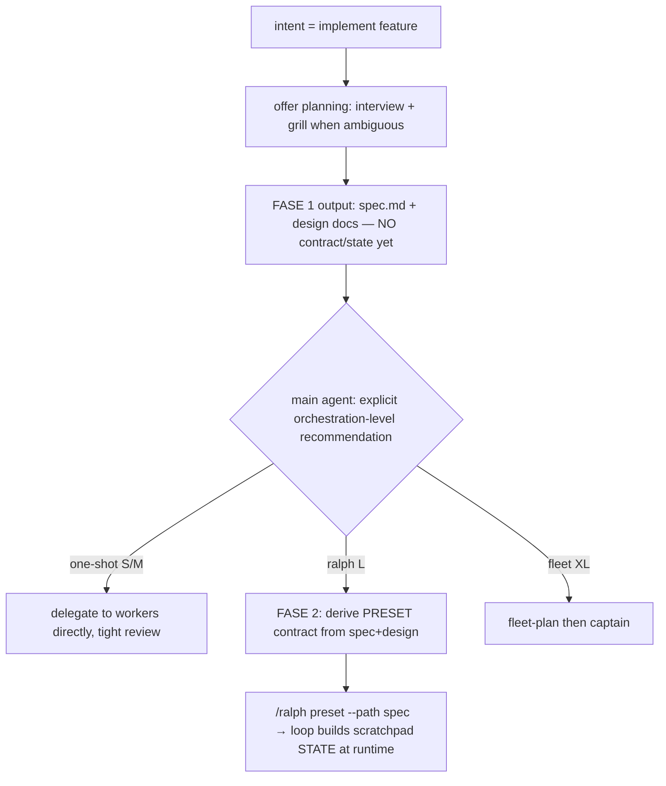

# Ralph migration + development-lifecycle flow lock

<Callout type="warn" title="Status: proposed — awaiting execution approval">
Nothing installed or rewritten yet. This doc is the reviewable contract before execution.
</Callout>

## Problem

`@lnilluv/pi-ralph-loop` spawns each iteration as a subprocess:

```
pi --mode rpc --no-session --no-extensions -e <ralph>
```

`--no-extensions` (hardcoded, `runner-rpc.ts:182`, no user escape hatch) disables ALL other extensions inside every ralph iteration:

- ❌ `@kmmuntasir/pi-nested-subagents` → no `Agent` tool → ralph cannot delegate to implementer/reviewer workers. The whole fault-tolerance routing + model-tier flow is dead inside ralph.
- ❌ `pi-rules` → path-scoped rule injection dead.
- ❌ grill, vcc, mcp, searxng, playwright, LSP — all off.
- (`--no-skills` is NOT passed, so skills still load — but skills are prompt text, can't restore the missing `Agent` tool.)

<Callout type="danger" title="Incompatibility">
Current ralph is fundamentally incompatible with the orchestrator-delegates-to-workers model in AGENTS.md. It runs as a flat, single-agent, tool-restricted loop — not an orchestrator that spawns the subagent fleet.
</Callout>

## Decision: migrate to `pi-ralph` (samfp)

<Decision title="Replace @lnilluv/pi-ralph-loop with pi-ralph (samfp)" status="accepted">
Source-verified: **0 subprocess spawns**. In-process via `pi.sendMessage({ triggerTurn: true, deliverAs: "followUp" })`. Each iteration is a new turn in the SAME session → subagents + rules + all extensions stay live.
</Decision>

Key mechanics (verified in `pi-ralph` source):

- **Hat roles** — each iteration the agent wears one role (Planner/Builder/Reviewer/Committer). A hat has `triggers` (events that activate it), `publishes` (events it can emit), `instructions` (system prompt for that turn), `disallowed_tools`, `max_activations`. When a hat publishes an event, the extension looks up the next hat and fires it as a `followUp` turn.
- **Fresh session per hat** (`index.ts:1091`): every hat transition calls `newSession()` → context window RESET. State carries across hats via a disk file `.ralph/scratchpad.md`, NOT conversation history. A 100-iteration loop keeps ~constant context.
- **Completion gate**: loop stops when `event_loop.completion_promise` string appears, or a terminal hat publishes an event no other hat triggers, or `max_iterations` / `max_runtime_seconds` / per-hat `max_activations` hit, or `detectStaleCycle` fires.
- **Preset dirs** (precedence): built-in `<ext>/presets/` < user `~/.pi/agent/ralph/presets/*.yml` < project `.pi/ralph/presets/*.yml`.

<Callout type="success" title="Context-blowup concern resolved">
Fresh-session-per-hat means hats do NOT accumulate context. The state carrier is the scratchpad file on disk, exactly like the fleet/old-ralph durable-state design. pi-loop (the other candidate) would blow up context because it re-injects into the same session — pi-ralph does not.
</Callout>

## The two-phase planning model (locked)

There are TWO distinct planning steps. This is the crux of the flow.



<Callout type="info" title="No collision with the level decision">
The Planner hat lives ONLY inside the ralph loop, which starts AFTER the level is chosen. The one-shot/ralph/fleet decision happens in the main agent, pre-loop. Different phases, sequential — the hat never touches the level decision.
</Callout>

### Contract vs State (ralph)

| Artifact | Content | Author | When |
|---|---|---|---|
| **Contract** = preset `.yml` | hats (roles) + gate + guardrails | main agent (pre-loop), from spec+design | FASE 2, before `/ralph` |
| **State** = `.ralph/scratchpad.md` | task checklist + per-iteration progress | hat-1 at runtime (ingest, not re-plan) | inside loop |

A hat CANNOT author the contract (chicken-egg: the preset is the input to the loop the hat runs in). Main agent authors/selects the preset pre-loop.

## Decisions locked

<Decision title="Preset strategy = hybrid" status="accepted">
Default: pick a fixed built-in-derived preset. Generate a custom preset only when no fixed one fits the task.
</Decision>

<Decision title="Fix re-plan duplication = fork presets into -ingest variants" status="accepted">
Built-in preset hat-1 writes spec/plan from scratch → duplicates FASE-1 work. Fork each into an `-ingest` variant whose hat-1 READS the existing spec+design and decomposes into the scratchpad WITHOUT re-planning. Store in `~/.pi/agent/ralph/presets/`.
</Decision>

<Decision title="In-loop work = delegate to worker subagents" status="accepted">
Builder/Reviewer hats SPAWN worker subagents per the fault-tolerance routing (low→implementer-critical/deep-reviewer, standard→implementer/reviewer, trivial→implementer-lite/reviewer). Hats orchestrate; workers do the code. Enabled because pi-ralph is in-process.
</Decision>

<Decision title="Scope this pass = ralph only" status="accepted">
Goal-based flow (pi-goal-x) deferred to a separate pass. Memory already handled — `pi-memory-stone` installed, machine-local SQLite at `~/.pi/agent/memory/memory.db`.
</Decision>

## Intent detection (locked, general dev lifecycle)

Main agent, at start of chat, routes by intent:

- **implement feature** → FASE 1 planning flow above (offer planning, interview, grill when ambiguous), then explicit orchestration-level recommendation, then FASE 2.
- **existing issue / dump log / error / stack trace** → DEBUG MODE (not feature mode). Two steps: (1) gather info/repro/env/expected-vs-actual; (2) branch by fix size — small = execute directly (main agent MAY touch code, the deliberate orchestrator exception), medium/large = route into a planning flow (ralph or fleet).
- **info / find / research / other** → serve per request, no ceremony.

## Work items

1. **Install `pi-ralph`, remove `@lnilluv/pi-ralph-loop`** from `settings.json` packages.

<Callout type="warn" title="Skill loss check">
lnilluv ships `ralph-loop` + `ralph-draft` skills. They disappear on removal — decide whether pi-ralph's own skills cover the gap or whether replacements are needed.
</Callout>

2. **Fork presets → `-ingest` variants** in `~/.pi/agent/ralph/presets/`:
   - hat-1 changed from author→ingester: "read spec at `<path>` + design docs; do NOT re-plan or reinterpret; spec is approved; decompose into atomic task checklist in scratchpad."
   - Builder/Reviewer hats: add "delegate to worker subagent per fault-tolerance tier" instructions + spawn `Agent`.
   - Candidates to fork: `feature`, `spec-driven`, `refactor`, `debug` (debug preset ties into DEBUG MODE routing).
3. **Rewrite AGENTS.md ralph section**: correct the model (in-process, hat roles, fresh-session-per-hat, scratchpad state, delegates to workers, subagents+rules alive). Remove wording implying ralph is isolated/flat/no-subagents.
4. **Update flow-offer taxonomy** in AGENTS.md: encode the two-phase planning (spec/design → level recommendation → contract/state) and intent detection (feature vs debug vs request).
5. **Create skill `ralph-preset`** at `~/.pi/agent/skills/ralph-preset/SKILL.md` — scaffolds a custom preset from spec+design when no fixed `-ingest` preset fits: ingest hat-1 (read spec, no re-plan), delegate-aware Builder/Reviewer hats (spawn worker subagent per fault-tolerance tier), completion_promise gate, guardrails (max_iterations/max_runtime_seconds/max_activations). Keeps custom generation consistent + delegate-aware.
6. **chezmoi sync** all of the above (settings, presets, AGENTS.md, skill), commit + push.

## Resolved decisions

<Decision title="Custom-preset authoring = skill scaffold" status="accepted">
When a custom preset is needed (hybrid fallback), a `ralph-preset` authoring skill scaffolds the YAML from spec+design (ingest hat-1 + delegate-aware Builder/Reviewer + gate + guardrails), rather than hand-authoring each time. Ensures consistency.
</Decision>
