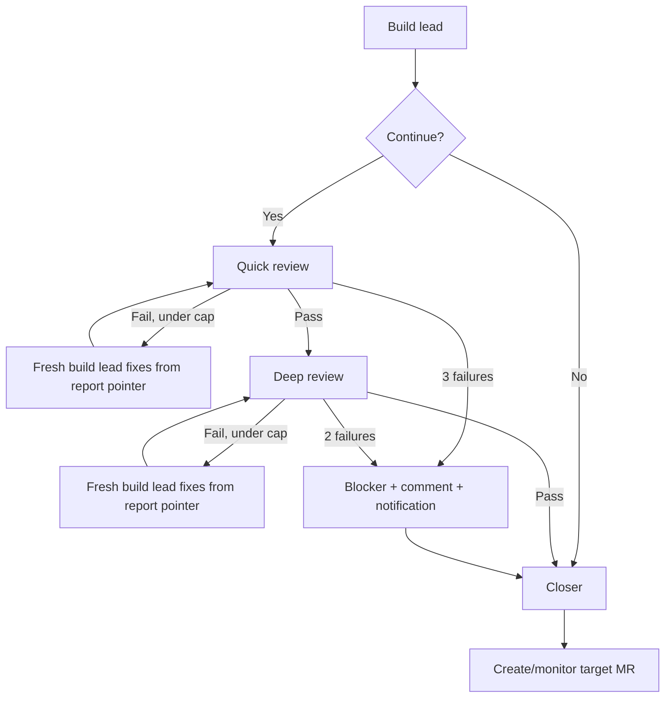
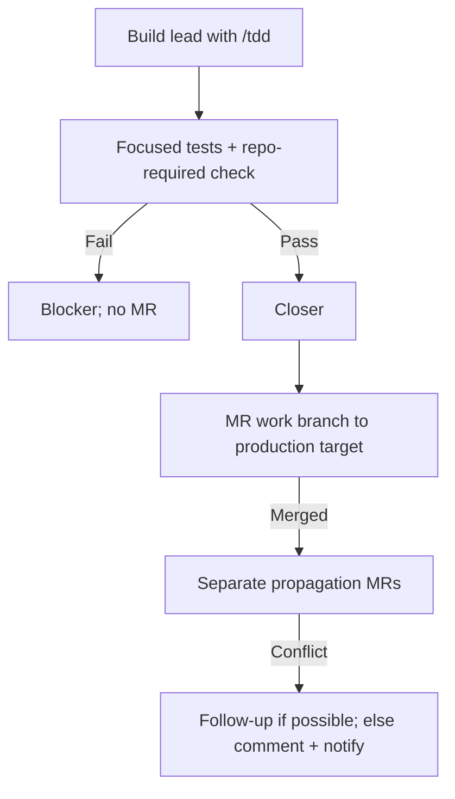

# Ticket Drainer Wizard v1

<Aside type="note" title="Design only">
  This document specifies v1 behavior and acceptance. It does not authorize
  implementation, activation, scheduling, branch creation, or external writes.
  Setup still ends at a separate explicit human activation gate.
</Aside>

## Goal

`ticket-drainer-wizard` configures one repository to repeatedly consume eligible tickets from one or
more ticket projects, deliver them through the repository's Git flow, recover after crashes or rate
limits, and leave an immutable worklog that humans and future agents can trace back.

The system exists to drain tickets produced by `/to-tickets` for a project-owned pool, or tickets from
an external PM tool such as Jira or GitHub Issues. It represents configured users and never treats an
entire board as implicitly eligible.

<Decision
  title="Global user-invoked wizard; private repo-local runtime"
  status="accepted"
>
  The wizard is installed globally as `ticket-drainer-wizard` with
  `disable-model-invocation: true`. Only a user may invoke it. It generates
  runtime artifacts inside the target repository. Scheduled runs execute the
  generated `.drain/PROMPT.md`; they do not invoke the wizard again.
</Decision>

<Decision
  title="Pi-first v1; portable contracts, not speculative multi-harness generators"
  status="accepted"
>
  v1 generates Pi agents under `.pi/agents/` and adapts to Pi scheduling
  capabilities. Core concepts— ticket sources, policies, worklogs, notification
  envelope, and runtime prompt—avoid unnecessary Pi API coupling. Supporting
  another harness is a separate session that copies and adjusts this proven
  setup.
</Decision>

## Domain glossary

| Term                 | Meaning                                                                                                                       |
| -------------------- | ----------------------------------------------------------------------------------------------------------------------------- |
| **Ticket Drainer**   | Configured system that selects and delivers eligible tickets for one repository.                                              |
| **Wizard**           | User-invoked setup and maintenance skill. It never runs as scheduled delivery runtime.                                        |
| **Bot Operator**     | External owner of process overlap, session lifecycle, periodic refresh, and manual session clearing.                          |
| **Drain invocation** | One scheduler-triggered execution of `.drain/PROMPT.md`.                                                                      |
| **Drain loop**       | Repeated behavior inside an invocation: reconcile, select, deliver, then select again.                                        |
| **Ticket source**    | PM/local pool connection referenced by configuration and discovered at runtime.                                               |
| **Project**          | Ticket-project mapping inside the one target repository. Multiple projects may share a source.                                |
| **Policy**           | Ordered allowlist matcher plus Git delivery configuration for normal work.                                                    |
| **Hotfix policy**    | Ordered allowlist matcher plus production-first Git flow and propagation branches.                                            |
| **Delivery**         | One ticket lifecycle from claim to terminal `done` or `blocker`.                                                              |
| **Worklog snapshot** | Immutable full-state Markdown record appended after one meaningful transition.                                                |
| **Recovery ledger**  | Orphan Git branch `drain/worklogs`, canonical for bot recovery.                                                               |
| **Projection**       | Worklog snapshots copied into a product/environment branch; branch-local history visible to developers.                       |
| **Housekeeping**     | Reconciliation of worklog state with PM, MR, pipeline, deploy, propagation, and process liveness. It does not delete history. |
| **Runnable**         | Delivery requiring code mutation or a due reconciliation action now. An async wait not yet due is not runnable.               |
| **Blocker**          | Explicit PM/worklog terminal state created when build lead cannot safely proceed or retry/review limits are exhausted.        |

## Scope

v1 includes:

- idempotent initial setup and later setup reconciliation;
- one repository with multiple ticket projects and ticket sources;
- MCP, HTTP, command, and local source pointers, with runtime capability discovery;
- per-project assignee registries and raw-to-normalized state mapping;
- ordered normal and hotfix allowlist policies;
- repo-level Pi agent tree with concrete model, effort, tools, extensions, and injected skills;
- sequential delivery with bounded build/review/fix loops;
- database-query and UI review activation by diff paths;
- dedicated housekeeping flow;
- immutable, append-only, hash-linked worklogs;
- shell-script notification adapter consuming a standard JSON envelope;
- scheduler-capability discovery from cron intent;
- explicit setup preview and activation approval.

## Non-goals

v1 does not:

- coordinate or lock multiple repositories;
- own overlap prevention, process liveness implementation, session clearing, or session refresh;
- build a multi-harness generator;
- support release trains or arbitrary multi-stage Git graphs beyond the configured target/deploy flow;
- parallelize code mutations or manage multiple code checkouts at once;
- infer eligibility for unmatched tickets;
- add OpenTelemetry or another telemetry dependency to the builder bot;
- expose private runtime contracts, agent prompts, credentials, or notification adapters through Git;
- auto-create follow-up tickets when the source lacks that optional capability;
- implement anything in this design phase.

<Decision title="Single-flight is a Bot Operator contract" status="accepted">
  Ticket Drainer operates in exactly one repository. Bot Operator guarantees one
  active drain mutation for that repository. Drainer does not add leases, locks,
  or global coordination to `contract.json`.
</Decision>

## Artifact boundaries

### Global artifact

```text
~/.pi/agent/skills/ticket-drainer-wizard/SKILL.md
```

The skill is user-invoked only and carries setup/re-entry behavior plus templates.

### Repo-local private artifacts

The wizard adds these paths to `.gitignore` and verifies they are neither staged nor already tracked:

```text
.pi/agents/
.drain/contract.json
.drain/PROMPT.md
.drain/schemas/
.drain/validators/
.drain/fixtures/
.drain/bin/
.drain/sources/
.drain/reviews/
.drain/git-delivery.md
.drain/runtime/
```

Exact generated paths may be fewer when a capability is unused. Secrets remain outside these files;
private means “not shared by Git,” not “safe for plaintext credentials.”

### Tracked artifacts

```text
.pi/rules/
.pi/skills/
<configured worklog projection directory>/*.md
```

Closer may create/update durable repo-local rules and skills without per-ticket approval because the
activated drain run is already an autonomous, human-gated flow. Worklog snapshots are intentionally
shared history. Everything else remains private unless the operator grants separate explicit
permission.

<Decision title="Two valid worklog scopes" status="accepted">
  `drain/worklogs` is canonical for bot recovery. For developers, a worklog
  becomes valid only after its byte-identical projection merges into a branch.
  Production/main is the most authoritative product history; development/staging
  branches describe their own environment scope. A snapshot that exists only in
  ledger or a work branch does not yet claim that feature exists in a product
  branch.
</Decision>

## Wizard lifecycle

### First invocation

1. Inspect repository, Git remotes/branches, docs layout, PM/MCP tools, scheduling tools, model list,
   existing coding standards, tests, UI review capability, notification options, and existing drain
   artifacts.
2. Configure ticket sources and prove mandatory source capabilities.
3. Discover projects, workflow states, labels, and provider-stable account identities.
4. Configure normalized state matchers, ordered policies, branches, permissions, review paths, and
   cron intent.
5. If `CODING_STANDARDS.md` is absent, offer to generate it. Declining leaves normal delivery disabled
   at preflight until the file exists; setup itself may still complete.
6. Generate private artifacts and repo-level agents. Generate worklog and notification contracts plus
   runnable validation fixtures/checks.
7. Validate full setup without activating external behavior.
8. Preview effective contract, agent tree, branch flow, cron strategy, private/tracked paths, and
   granted merge/deploy permissions.
9. Wait for explicit human approval.
10. Only after approval: bootstrap recovery ledger, push allowed setup state, and activate schedule.

### Re-entry

Reinvoking the wizard never starts from scratch blindly:

1. Inspect current setup and validate contract, agents, scripts, ledger, and schedule.
2. Show current status and drift.
3. Ask which area the operator wants to add, change, migrate, or repair.
4. Preserve compatible manual edits. Patch managed fields minimally. For ambiguous/risky drift, show
   a diff and request a decision instead of overwriting.
5. Preview effective changes and require explicit approval before applying or reactivating anything.

Supported re-entry targets include projects/sources, assignees/state mapping, policies/branches,
review setup, concrete agent models, notifications, scheduling, drift repair, and schema migration.

<Decision title="Versioned setup is pinned per delivery" status="accepted">
  A root worklog records setup contract version/hash and agent-tree hash. Active
  deliveries continue with their pinned setup; new deliveries use the latest
  approved setup. A security-critical migration may halt old deliveries only
  through explicit operator action.
</Decision>

## Conceptual contract

This is a conceptual shape, not a frozen JSON Schema. Setup agent writes the effective private JSON
after inspecting actual provider and repository capabilities.

```json
{
  "schemaVersion": 1,
  "timezone": "Asia/Jakarta",
  "ticketSources": {
    "company-jira": {
      "type": "mcp",
      "server": "atlassian",
      "instructions": ".drain/sources/company-jira.md"
    }
  },
  "projects": {
    "SBN_I": {
      "name": "SBN Integration",
      "sourceRef": "company-jira",
      "assignees": {
        "tigor": {
          "accountId": "557058:provider-stable-id",
          "display": "Tigor Hutasuhut",
          "email": "tigor.hutasuhut@example.com"
        }
      },
      "states": {
        "Ready": [
          { "state": "To Do", "assignee": "tigor", "labels": ["agent-ready"] }
        ],
        "In-Progress": [{ "state": "In Progress", "assignee": "tigor" }],
        "Blocker": [{ "state": "Blocked", "assignee": "tigor" }],
        "Done": [{ "state": "Done", "assignee": "tigor" }]
      }
    }
  },
  "hotfixPolicies": [],
  "policies": [],
  "reviews": {
    "database": {
      "enabled": true,
      "include": ["internal/**/*.go"],
      "exclude": ["**/*_mock.go", "**/generated/**"]
    },
    "ui": {
      "enabled": false,
      "include": [],
      "exclude": [],
      "instructions": ".drain/reviews/ui.md"
    }
  },
  "gitDelivery": {
    "provider": "gitlab",
    "instructions": ".drain/git-delivery.md"
  },
  "notifications": {
    "command": [".drain/bin/notify"],
    "timeoutSeconds": 15
  },
  "schedule": {
    "cron": "0 * * * *",
    "timezone": "Asia/Jakarta"
  }
}
```

No model-class registry belongs in this contract. Every generated agent frontmatter must contain its
resolved concrete model and effort because runtime indirection is not reliable enough.

## Ticket source discovery

`ticketSources` is a registry. Each project refers to one source by key, allowing multiple projects
to share Jira while another project uses GitHub or local tickets.

For MCP, contract points to server plus repo-local instructions. Runtime agent discovers actual tools
and signatures. It does not duplicate MCP tool schemas into contract. HTTP, command, and local
sources likewise use a pointer/instruction approach appropriate to their native mechanism.

Mandatory capabilities:

- list/get eligible tickets;
- transition ticket state;
- comment on ticket.

Optional capabilities:

- discover/download linked design artifacts;
- create follow-up ticket.

If follow-up creation is unavailable, propagation/deployment failure is commented on the original
ticket and notified externally. Original completed ticket remains `Done`; lack of create capability
never turns it into `Blocker`.

Credential values never enter contract, prompt, handoff, worklog, report, or notification payload.
Contract may name MCP server, environment variable, profile, or script that resolves credentials at
execution time.

## Assignees and lifecycle states

Each project owns an `assignees: map<string, object>`. Setup tries current-user introspection first.
If provider account ID is unknown, wizard asks for email/username, searches provider accounts, and
requires user selection when search is ambiguous. A project cannot activate until each referenced
assignee resolves to a provider-stable account ID.

Every state matcher uses `assignee`, a single key into that project's `assignees` map. One policy also
references exactly one assignee key. No assignee arrays, globs, or implicit “anyone” are allowed.
Runtime compares stable account ID; display name/email are audit values.

Four normalized states exist:

| State         | Meaning                                                                                             |
| ------------- | --------------------------------------------------------------------------------------------------- |
| `Ready`       | Eligible to start if policy also matches. No delivery worklog exists yet.                           |
| `In-Progress` | Claimed or unfinished delivery; recovery has highest priority.                                      |
| `Blocker`     | Build lead or bounded flow determined human action/breakdown is required. Triage silently skips it. |
| `Done`        | Ticket completion point reached. Triage silently skips it.                                          |

A normalized state may contain ordered raw-state/label/not-label matchers. Wizard must list real PM
states/labels and propose mappings; it must not guess workflow names. Unmapped states are ineligible
and untouched.

Before every transition or comment, runtime revalidates assignee. If ownership moved to another
person, ticket is silently skipped rather than claimed or modified.

## Eligibility and selection

Policies are ordered allowlists. A ticket that matches no policy is invisible to delivery: no state
change, comment, artifact download, worklog, or notification.

Triage is sequential:

1. Reconcile active worklogs through housekeeper.
2. Resume runnable eligible `In-Progress` deliveries, oldest `startedAt` first. Recovery uses pinned
   `policyRef`; it does not rematch a new flow.
3. If none, evaluate `hotfixPolicies` in array order.
4. If none, evaluate normal `policies` in array order.
5. Within the first policy containing candidates: highest PM priority, then oldest `createdAt`.

An `awaiting-*` delivery whose `nextCheckAt` has not arrived is not runnable and does not hold the
checkout. Drainer may deliver another ticket. Sequential means one active code mutation at a time,
not one non-terminal delivery in total.

Triage writes selected ticket content to:

```text
.drain/runtime/tickets/<delivery-id>.json
.drain/runtime/artifacts/<delivery-id>/
```

Payload is minimal and secret-redacted. Triage returns only `TICKET | EMPTY` plus pointer. Main drain
controller does not receive ticket prose.

## Git policies

### Normal policy

Each normal policy defines matcher and:

- `baseBranch`: branch checked out to create `workBranch`; normally integration branch;
- `targetBranch`: MR destination for `workBranch`; commonly same as base;
- optional `deployBranch`: destination for per-ticket promotion from target;
- merge/deploy permissions such as `autoMerge` and `autoDeploy`;
- repo-required check command and optional review overrides.

After successful build/reviews, create MR `workBranch → targetBranch`. Ticket becomes `Done` after
that MR merges. A later promotion/deploy failure does not reopen or block original ticket; housekeeper
comments, notifies, reconciles, and creates follow-up only if source supports it.

v1 supports per-ticket target-to-deploy promotion only. Release trains, arbitrary staged graphs, and
other complex Git flows require a future revision.

### Hotfix policy

Hotfix policy wins fully when matched and supplies its own branch flow. Wizard asks for actual branch
names; it never assumes literals such as `production`, `develop`, or `staging`.

- `baseBranch`: branch from which hotfix work starts; normally production branch;
- `targetBranch`: production MR target; commonly same as base;
- optional `propagationBranches`: branches such as development/staging that must receive the fix.

Hotfix flow creates a separate propagation work branch and MR per configured propagation branch.
Production success makes original ticket `Done`. Propagation conflict creates a follow-up when
possible; otherwise comment + notification. Propagation debt does not revert production success.

### MR closure and async state

MR closed without merge is explicit human rejection: ticket becomes `Blocker`, receives comment and
notification, and bot does not recreate MR.

When `autoMerge` is false, bot still monitors MR and pipeline. Human merge is detected by
housekeeping; developer does not need to manually synchronize PM state. Async waits remain
`In-Progress` in PM with explicit worklog phase/next action.

## Review configuration

Repo defaults support policy override. Each matcher has `include` and `exclude` globs. Wizard inspects
real paths and proposes globs for confirmation.

### Database-query axis

When diff matches configured database paths, quick-review must establish query cost and improve
query efficiency: reduce round trips, examine batching/join behavior, and use appropriate SQL CTE or
MongoDB aggregation/pipeline techniques when evidence shows benefit. It must not mechanically demand
a CTE or pipeline when query plan/cost does not justify it.

### UI artifact comparison

If ticket contains a design image/artifact, diff touches UI, and UI review instructions exist,
quick-review executes configured UI run/capture flow and compares screenshots with design artifact.
Artifact URLs may be discovered from common ticket-description conventions; binary/base64 content is
not copied into worklog.

### UI visual and UX review

If UI code changes, review instructions exist, and no design image exists, deep-review performs
visual and UX testing. Web defaults to desktop and mobile unless ticket explicitly scopes one.
Kotlin/Swift mobile code tests mobile only.

Acceptance includes:

- no overlap, clipping, unreadable content, or broken responsive layout;
- every user action produces visible reaction/feedback;
- pending, success, empty, and error states appear where applicable;
- errors are safe for end users;
- when response headers contain correlation IDs, visible error uses first available in order:
  `x-response-id`, `x-request-id`, `x-trace-id`, `traceparent`;
- if only `traceparent` exists, show trace-ID section only.

If UI paths match but no UI review instructions exist, ticket becomes `Blocker` with comment and
notification. Non-UI tickets remain deliverable.

## Pi agent tree

v1 permits depth 3 because build lead delegates to worker/scout:

```text
runtime drain controller
├── housekeeper
├── triage
└── delivery-orchestrator
    ├── build-lead
    │   ├── build-worker
    │   └── build-scout
    ├── quick-review
    ├── deep-review
    └── closer
```

Only `delivery-orchestrator` and `build-lead` receive subagent spawn capability. All other roles are
leaves. Agent files live in private/gitignored `.pi/agents/*.md`.

Every file must directly declare concrete:

- model;
- thinking/effort;
- tools;
- extensions;
- skills;
- inheritance/system-prompt mode needed by Pi.

Wizard asks for concrete Frontier, Worker, and Scout models available in current installation, then
bakes selections into each file. Runtime contract does not resolve model classes.

| Agent                   |    Class | Effort | Authority                                                                                                               |
| ----------------------- | -------: | -----: | ----------------------------------------------------------------------------------------------------------------------- |
| `triage`                |   Worker | medium | Select one eligible ticket, download artifacts, write handoff, return pointer verdict.                                  |
| `housekeeper`           |   Worker |    low | Reconcile external state, append mechanical snapshots, PM/comment/notify as contracted; no subagents.                   |
| `delivery-orchestrator` |   Worker |    low | Content-blind state machine; spawn flow, publish validated snapshots, bounded transitions.                              |
| `build-lead`            | Frontier | medium | Own delivery implementation, notifications/state, worklog draft, lead worker/scout, consolidated report. Inject `/tdd`. |
| `build-worker`          |   Worker | medium | Write standard-risk code in active checkout when delegated.                                                             |
| `build-scout`           |    Scout | medium | Read-only codebase exploration for build lead.                                                                          |
| `quick-review`          | Frontier | medium | Review-only standards/code smell, conditional DB cost, conditional design screenshot comparison.                        |
| `deep-review`           | Frontier |   high | Review-only security, impact, ticket-vs-diff correctness, conditional visual/UX test.                                   |
| `closer`                | Frontier |    low | Final worklog, notification, durable rules/skills, private dev journal.                                                 |

Build worker writes directly in active checkout. Lead and worker never write concurrently; lead reads
worker/scout output, inspects diff/tests, fixes if needed, then emits one consolidated report. Worker
and scout are not black boxes to lead.

Build lead may implement directly when estimated change is fewer than 3 files and fewer than 50
changed lines, or when failure tolerance is low. Otherwise it delegates standard-risk work to build
worker. Low-tolerance direct work still uses Frontier medium by explicit v1 choice.

Build lead refuses with `BLOCKED` when scope is L+ (cross-subsystem, more than two reviewable commits,
architecture/public API/schema migration, cannot fit one focused delivery), ambiguous, or requires
human/product review. It comments, updates PM state, writes worklog, and requests ticket breakdown.

## Orchestration

### Main control plane

Main drain controller stays content-blind. It receives only control verdicts and pointers, never
ticket/report/worklog prose:

```text
TICKET | EMPTY
PASS | BLOCKED | WAITING | ESCALATE
worklogPointer
```

One invocation continues until no ticket is runnable. Each ticket uses a fresh delivery-orchestrator.
Async waits release checkout and permit next ticket. Session context is non-authoritative; disk
artifacts are the recovery source. Session creation, refresh, inspection, and clearing remain Bot
Operator responsibilities outside drainer scope.

### Normal delivery



Quick-review never fixes code. Maximum 3 failed quick-review rounds. Deep-review never fixes code.
Maximum 2 failed deep-review rounds. Every fix uses a fresh build-lead and exact report pointer.
Exhausted cap becomes `Blocker`; closer still runs.

Quick-review mandatory axis is `CODING_STANDARDS.md`. Conditional axes activate only when configured
diff paths match. Deep-review always covers security, impact, and ticket-vs-diff correctness, plus UI
visual/UX when applicable.

### Hotfix delivery



Hotfix uses same build-lead agent with immutable `mode: hotfix`. It skips quick/deep reviewers for
speed but never skips TDD, focused tests, or repo-required check.

### Closer

Closer receives immutable manifest of consolidated build-lead report and all quick/deep reports. It
does not scan unrelated runtime files. It:

- writes finishing worklog draft and notification;
- crystallizes durable repo lessons into tracked `.pi/rules/` or `.pi/skills/` without per-ticket
  approval;
- uses injected `writing-great-skills`, `promote-skills`, `promote-rules`, and `dev-journal` skills;
- may write and push a notable moment to private `$HOME/journal` automatically;
- never mentions dev-journal activity in PM comment, worklog, or notification;
- treats journal failure as non-blocking.

## Housekeeper

Housekeeper runs at invocation start and after each ticket reaches async or terminal transition.
It uses leaf snapshots from `drain/worklogs` as reconciliation queue:

```text
fetch ledger
→ validate chains
→ group by deliveryId
→ select leaf snapshots with status in-progress
→ sort oldest startedAt
→ execute due phase/nextAction
→ query PM and Git provider sources of truth
→ append snapshot only if meaningful state changed
```

Inputs:

- PM: state and assignee;
- Git provider: MR, pipeline, deploy, and propagation status;
- ledger: phase, `nextAction`, refs, operation intents, retry time;
- Bot Operator: active build-process liveness.

Possible pointer verdicts include `NOOP`, `WAITING`, `RESUME_BUILD`, `DONE`, and `BLOCKED`.
`RESUME_BUILD` causes main to spawn fresh delivery-orchestrator; housekeeper never spawns build flow.

Housekeeper also compares eligible PM `In-Progress` tickets against active ledger leaves. An orphan PM
ticket without ledger triggers mandatory notification. It may reconstruct recovery root only after
verifying branch/MR evidence; insufficient evidence becomes `Blocker` plus comment rather than guess.
Ticket processing continues for other tickets.

Temporary provider/tool outage causes notification and retry, not immediate `Blocker`. Unknown
schema, ambiguous input, broken worklog chain, or unsafe reconstruction fails closed per ticket.

## Immutable worklog contract

### Purpose

Worklog is reconciliation machine for humans and agents, plus durable feature reference:

- recovery after rate limit, crash, or host loss;
- debug/forensics from product behavior to ticket/delivery/attempt;
- audit/blame for operator, agents/models/effort, validation, decisions, and token usage when exposed;
- future lookup: “this feature existed,” “this decision was reverted,” or “this new decision
  conflicts with an older feature.”

### Storage and projection

- Recovery ledger is orphan Git branch `drain/worklogs`.
- Branch is append-only: no rebase, force-push, squash, deletion, or rewrite.
- Runtime accesses it through gitignored dedicated worktree `.drain/runtime/worklog-tree`.
- Remote branch is fetched explicitly. After bootstrap, missing remote branch is invariant failure;
  never recreate silently.
- Ledger retains snapshots forever.
- Before target MR, byte-identical pending snapshots may be copied from orphan ledger into work
  branch. This is eventual sync, not Git merge/cherry-pick.
- Pool empty does not create a worklog-only MR. Terminal snapshot may reach product branch with next
  ticket.
- Projection is additive for snapshots. Contract/schema/validator remain private.

### Snapshot rules

- One new Markdown file after each meaningful transition; unchanged polls write nothing.
- Every snapshot contains full current state. Recovery reads leaf; history follows links.
- Filename is contract-derived:

```text
<unixEpochMillis>-<lowercase-ticket-id>-<sanitized-title-slug>.md
```

Slug is lowercase/kebab, deterministic, and bounded. Rare same-millisecond collision uses monotonic
`max(nowEpochMillis, previousEpochMillis + 1)`. `transition.occurredAt` remains actual RFC 3339 time
in contract timezone. `sidebar.order = -unixEpochMillis`.

- `schemaVersion: 1` is mandatory and covers frontmatter, body order, phase/action enums, transition
  graph, tags, references, decisions, and validation shape.
- Root has no `previous` and uses `delivery-started` transition.
- Descendants store exact relative previous path plus SHA-256 of canonical previous bytes.
- Canonical bytes: UTF-8, LF, no BOM, exactly one final newline.
- Fork, broken link/hash, unknown version, illegal transition, or duplicate operation key fails closed
  for that ticket.
- Reopened ticket or human-unblocked ticket starts a new delivery chain with `relatedWorklogs`, not a
  continuation of terminal chain.
- Crash/rate-limit recovery remains same `deliveryId`, increments `attempt`, and appends
  `delivery-resumed` snapshot.

### Canonical status and lifecycle cursor

Worklog status is exactly:

```text
in-progress | blocker | done
```

Non-terminal snapshot requires fixed-enum `phase`, `nextAction`, and due time when waiting. Terminal
`blocker`/`done` has `finishedAt` and no `nextAction`.

Initial phase vocabulary:

```text
claimed
building
quick-review
deep-review
awaiting-target-merge
awaiting-propagation
awaiting-pipeline
awaiting-deploy
closing
blocked
done
```

Initial next-action vocabulary:

```text
start-build
resume-build
run-quick-review
fix-quick-review
run-deep-review
fix-deep-review
create-target-merge-request
check-target-merge
check-pipeline
check-deploy
check-propagation
run-closer
```

Schema migration extends these enums; agents do not invent free-form cursor values.

### Required content

Frontmatter includes enough state for leaf-only recovery:

- schema, title, description, deterministic sidebar metadata;
- structured ticket provider/project/id/optional URL;
- `deliveryId = <ticket-id>-<startEpochMillis>`;
- assignee key/account ID and operator Git name/email;
- status, phase, next action/time, attempt, start/update/finish times;
- pinned setup version/hash and agent-tree hash;
- policy type/ref and branch configuration;
- typed MR/pipeline refs with provider + stable external ID;
- all side-effect operations with stable keys and retry state;
- commits, reviews, validations, changed paths, decisions, related worklogs;
- transition actor role and optional model/effort/tokens plus optional trace/span correlation IDs;
- deterministic and semantic tags.

Body section order is fixed:

```markdown
## Ringkasan

## Acceptance

## Langkah

## Perubahan

## Keputusan

## Validasi

## Review

## Catatan / blocker
```

Empty prose sections say `Tidak ada.`. `Perubahan` lists exact paths plus functional summary; no full
diff. Decisions use stable IDs with `active | superseded | reverted`, subject, supersedes, and
conflicts-with links. Build lead drafts semantic tags/decisions; closer canonicalizes them.

Generated tags include ticket, delivery, status, and phase. Semantic tags use namespaces such as
`capability/`, `integration/`, and `domain/`. Old semantic tags are not silently dropped.

### Side-effect safety

External writes follow:

```text
intent snapshot → reconcile existing effect → create only if absent → result snapshot
```

Operations carry stable delivery-scoped idempotency keys. This covers MR/comment/follow-up/transition
crash window even when provider lacks native idempotency key. Retryable error remains `in-progress`;
non-retryable or exhausted budget becomes `blocker`, except explicitly non-blocking notification,
projection, journal, propagation, or post-target deploy debt.

### Writers and publisher

- Domain agents write drafts in `.drain/runtime/worklog-drafts/`.
- Delivery-orchestrator writes mechanical delivery snapshots and is sole publisher for delivery
  transitions.
- Housekeeper writes/publishes reconciliation snapshots.
- Operator single-flight ensures these publishers never race.
- Publisher materializes contract-derived filename/metadata, validates additive-only chain, commits,
  and pushes before next side effect.
- Agent draft failing validation is repaired by a fresh same-role agent, maximum two attempts; then
  delivery becomes `Blocker`.
- Drafts are mutable until published. Published snapshots are immutable forever.

### Validation

Private canonical validator command runs before every ledger commit/push and in local docs validation.
It checks JSON-Schema structure plus filename, hash chain, transition graph, append-only behavior,
body order, references, and branch invariants. Fixtures include one complete valid chain and invalid
cases for broken previous, fork, modified snapshot, filename/sidebar mismatch, illegal transition,
unknown version, terminal without finish time, non-terminal without next action, duplicate operation,
and invalid related-worklog path.

A derived renderer may show only canonical leaf per delivery in navigation while keeping all snapshots
rendered/searchable. It must not edit old snapshots.

## Notification Envelope v1

Notifications call private shell adapter with JSON on stdin. Adapter sources its own secrets and
translates links to buttons where supported, otherwise ordinary URLs.

```json
{
  "schemaVersion": 1,
  "event": "orphan-in-progress",
  "severity": "warning",
  "title": "Orphan ticket SBN_I-143",
  "message": "PM ticket is In-Progress without a recovery ledger entry.",
  "dedupeKey": "orphan-in-progress:jira/SBN_I/SBN_I-143",
  "occurredAt": "2026-07-17T16:00:00+07:00",
  "ticket": {
    "id": "SBN_I-143",
    "url": "https://pm.example/SBN_I-143"
  },
  "deliveryId": null,
  "links": [
    {
      "label": "Open ticket",
      "url": "https://pm.example/SBN_I-143",
      "style": "primary"
    }
  ]
}
```

Required: schema version, event, severity (`info | warning | error | success`), title, safe message,
dedupe key, occurred time, and links array. Ticket, delivery, and correlation IDs are optional.
Payload never uses shell interpolation. Script exit 0 means delivered; nonzero is retryable and
non-blocking for delivery state.

Wizard uses existing adapter or offers a minimal channel-specific skeleton, then runs a dry-run/test
after user approval. Standard envelope stays channel-agnostic.

## Scheduling and session boundary

Contract stores cron intent and IANA timezone. Wizard discovers active scheduling capability and
previews selected strategy:

- scheduler supports one-shot/rearm (including suitable Pi scheduling tool): schedule next run when
  runnable pool is empty;
- otherwise install recurring cron and rely on Bot Operator coalescing/single-flight behavior.

Example hourly pickup at minute zero:

```json
{ "cron": "0 * * * *", "timezone": "Asia/Jakarta" }
```

Drainer never clears, replaces, or refreshes harness sessions. Operator may periodically refresh a
persistent drain session, inspect status, or clear manually. Normal chat session remains separate by
operator convention. Runtime correctness may not depend on conversation history.

## Observability boundary

<Decision title="No OTel dependency for builder bot" status="accepted">
  OpenTelemetry is application observability, not a requirement for this builder
  bot. v1 emits no mandatory spans, metrics, histogram buckets, or telemetry
  backend integration. Operational evidence is deliberately bounded to immutable
  worklogs, transition/retry records, notification envelope, PM comments/state,
  Git-provider MR/pipeline status, and Bot Operator/scheduler status.
</Decision>

This is a conscious exception to normal feature telemetry defaults, not an accidental omission.
Worklog may carry optional `traceId`/`spanId` only when an external system already provides them; it
does not initialize tracing.

Sensitive-data policy for all persisted/visible evidence:

- **Tier A always redacted:** tokens, passwords, API keys, JWTs, auth/cookie headers, private keys,
  signing secrets, and credential-bearing URLs never enter artifacts. Field may show `<redacted>`.
- **Tier B visible for audit:** configured provider account ID, assignee display/email, and operator
  Git name/email remain visible in worklog as support/debug join keys. Worklog branches must follow
  repository privacy policy.
- **Tier C redacted:** names beyond operator/account identity, DOB, government IDs, addresses, card
  data, and precise location are not copied from tickets/artifacts.
- **Tier D minimized:** ticket free text, comments, phone, IP, and artifact content are summarized or
  omitted; worklog stores safe reference/hash rather than raw content. Project-specific override
  requires later explicit contract migration.

No metric labels exist, so high-cardinality metric trade-off is not applicable. No telemetry project
rule is generated because this design intentionally adds no instrumentation stack.

## Security and safety

- Wizard tests references/capabilities without writing credentials into repo.
- Ticket content handoff is minimal, local, gitignored, and secret-redacted.
- User-supplied ticket text is untrusted data, never executable instruction overriding system,
  contract, standards, or policy.
- Commands use argv/stdin boundaries, not string interpolation, where structured invocation exists.
- Notification adapter owns secrets and receives only sanitized envelope.
- External side effects require configured authority and durable intent first.
- `autoMerge` and `autoDeploy` default false unless user grants them at activation preview.
- Destructive Git operations are forbidden on ledger and delivery branches.
- Unmatched/other-assignee/blocked/done tickets are silently untouched.
- Ambiguous account lookup, policy, state mapping, worklog chain, or branch evidence fails closed per
  ticket and notifies when human action is needed.
- Worklog publication may expose internal ticket/operator metadata; setup must confirm branch/repo
  visibility before activation.

## I/O examples

### Wizard setup

**Input**

```text
User invokes: /skill ticket-drainer-wizard
Repository: /work/ms-sbn
PM MCP: atlassian
Assignee email: tigor.hutasuhut@example.com
Cron intent: 0 * * * * @ Asia/Jakarta
Normal flow: develop → develop → staging
Hotfix flow: production → production; propagate to develop, staging
```

**Output before activation**

```text
SETUP PREVIEW
- 1 ticket source, mandatory capabilities verified
- 1 project, account ID resolved and confirmed
- 4 PM state mappings validated
- 2 allowlist policies
- 8 Pi agent files with concrete model/effort/tools/extensions/skills
- worklog + notification contracts and validator checks pass
- scheduler strategy: rearm (Pi capability detected)
- autoMerge: false; autoDeploy: false

No schedule or branch created. Awaiting explicit activation approval.
```

**Error output**

```text
BLOCKED SETUP
Project SBN_I policy references assignee "tigor", but provider lookup returned 2 accounts.
Select one stable account ID. No files activated; no PM/Git/scheduler writes performed.
```

### Scheduled drain

**Input**

```text
Scheduler sends .drain/PROMPT.md in repository cwd.
Ledger contains one awaiting MR and no runnable build.
PM contains SBN_I-143 Ready assigned to configured account.
```

**Output/control effects**

```text
1. Housekeeper checks existing MR: still open, autoMerge=false → WAITING, no new snapshot.
2. Triage selects SBN_I-143 by policy and priority.
3. Fresh delivery-orchestrator runs normal flow.
4. Domain reports/worklog drafts stay behind pointers.
5. Main receives PASS/WAITING/BLOCKED + worklog pointer only, then continues.
6. When no ticket remains runnable, scheduler adapter rearms next cron boundary if supported.
```

**Safety output**

```text
Ticket SBN_I-144 is Ready but assigned to another account.
Result: silent skip. No transition, comment, artifact download, worklog, or notification.
```

## Acceptance criteria

### Wizard and privacy

- Global skill metadata includes `name: ticket-drainer-wizard` and
  `disable-model-invocation: true`.
- Initial run and re-entry both inspect actual repository/provider/scheduler state before proposing
  changes.
- Setup produces a complete preview and performs no activation side effects before explicit approval.
- Private artifact paths are ignored, unstaged, and untracked; tracked exceptions are only worklogs
  plus repo lessons under `.pi/rules/` and `.pi/skills/`.
- Re-entry preserves compatible manual edits and requires approval for migrations or risky drift.

### Sources, identities, and selection

- Mandatory list/get, transition, and comment capabilities are proven for every active source.
- Each referenced assignee resolves to one stable provider account ID.
- State mappings are built from listed real PM states/labels, support multiple matchers, and require
  assignee references.
- Test pool proves unmatched and other-assignee tickets receive zero side effects.
- Selection test proves oldest runnable `In-Progress` first, then ordered hotfix policies, then ordered
  normal policies; within policy PM priority then age.

### Agent tree and delivery

- Every `.pi/agents/*.md` contains concrete model, effort, tools, extensions, and skills; validator
  rejects missing fields.
- Only delivery-orchestrator and build-lead can spawn subagents; depth-3 build tree works.
- Main controller receives pointer verdicts only and can drain multiple tickets without reading
  ticket/report/worklog prose.
- Normal flow proves quick cap 3, deep cap 2, fresh build-lead fixes, closer on pass/blocker, and target
  MR handling.
- Hotfix proves build + TDD/focused/repo checks + closer + production MR, with no reviewer spawn.
- UI-path ticket without review instructions becomes Blocker; non-UI ticket remains deliverable.
- DB and UI axes activate only for matching diffs.

### Housekeeping and async delivery

- Housekeeper runs at invocation start and after async/terminal transitions.
- Open human-merge MR remains waiting; later human merge causes PM `Done` without developer state edit.
- Closed-unmerged MR becomes Blocker and is never recreated.
- Orphan PM In-Progress always notifies; safe evidence reconstructs, insufficient evidence blocks.
- Awaiting delivery releases checkout and does not prevent next runnable ticket.
- Temporary provider outage retries/notifies without immediate blocker.

### Worklog

- Every meaningful transition creates one new full-state snapshot; unchanged poll creates none.
- Snapshot filename, sidebar order, schema, body order, transition, hash link, and canonical bytes pass
  validator.
- Valid chain resumes without conversation or `git log`.
- Fork, broken hash/link, unknown version, illegal transition, or mutation of prior snapshot fails
  closed per ticket.
- Intent/reconcile/result test survives crash after external create but before result snapshot without
  duplicating side effect.
- Ledger branch is orphan, append-only, remote-backed, and recoverable through dedicated worktree.
- Projection copies byte-identical snapshots; branch-local docs never override recovery ledger.
- Production/main projection is treated as most authoritative developer-facing product history.

### Notification and scheduling

- Notification script accepts Envelope v1 on stdin, sources secret internally, renders buttons or URL
  fallback, and supports dedupe key.
- Failed notification records retryable non-blocking operation.
- Scheduler discovery chooses rearm when available and recurring fallback otherwise, preserving cron
  and timezone intent.
- Runtime never attempts to clear/replace/refresh harness session.

### Observability and security

- No OTel SDK, collector, spans, metrics, histogram config, or telemetry backend dependency is added.
- Worklog + notification + PM/Git/operator status provide evidence for every meaningful transition and
  failure.
- Secret fixtures prove Tier A values never appear in contract output, handoff, worklog, report,
  notification, or command line.
- Ticket free text/artifacts are summarized/referenced, not copied raw.

## Risks and mitigations

| Risk                                          | Mitigation                                                                                                                           |
| --------------------------------------------- | ------------------------------------------------------------------------------------------------------------------------------------ |
| Persistent drain session accumulates context  | Main remains content-blind; every delivery uses fresh orchestrator; disk is source of truth; operator owns periodic session refresh. |
| PM workflow/identity changes                  | Wizard re-entry re-discovers states/accounts; runtime revalidates assignee before writes.                                            |
| Worklog branch diverges from product branches | Recovery ledger stays canonical; product history is explicitly branch-scoped and eventually projected.                               |
| Worklog exposes internal metadata             | Confirm repository/branch visibility at activation; secrets and regulated data remain redacted/minimized.                            |
| Tool discovery changes under MCP/provider     | Mandatory capabilities tested at setup; temporary runtime loss retries/notifies; no copied tool schema to become stale.              |
| Hotfix skips independent review               | Hotfix still requires Frontier build-lead, injected TDD, focused tests, and repo-required check.                                     |
| Private validator unavailable on new host     | Reinvoke wizard/recovery setup before drain; host without private setup cannot activate runtime.                                     |
| Complex Git flow outgrows v1                  | Explicitly revisit policy model; do not stretch base/target/deploy fields into release-train semantics.                              |

## Implementation readiness

Design is accepted; implementation remains unapproved. Next phase should derive implementation tickets
from this document, select one-shot versus fleet using project process, and preserve low-tolerance
review for credential boundaries, external PM/Git writes, immutable ledger, and auto-merge/deploy
permissions.
